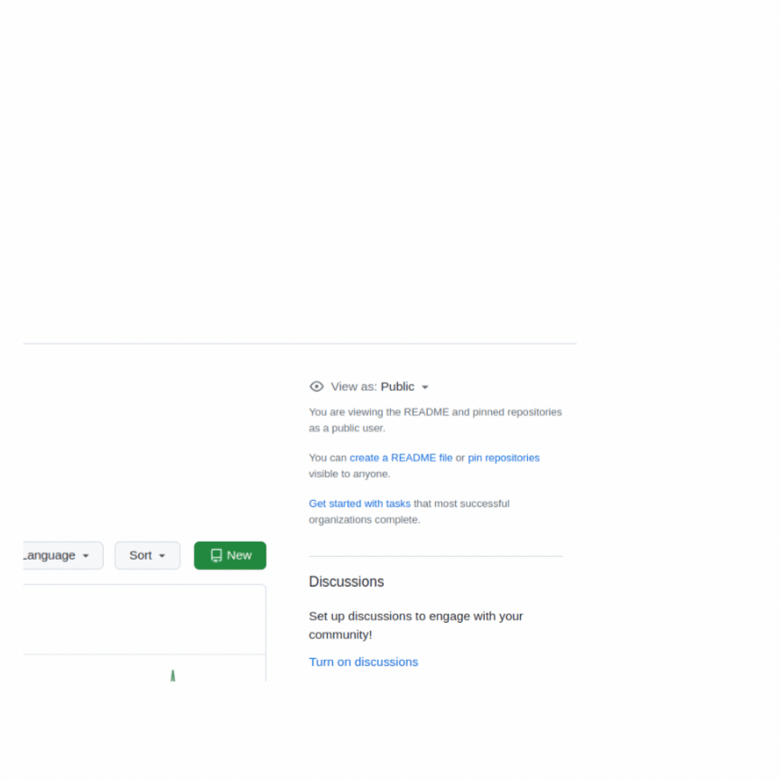

# Concepteur Développeur d'Applications

La formation CDA se base sur le REAC 2023 et à pour but de former aux 3 grands blocs de compétences. Elle se déroule en 10 saisons basées avant tout sur les concepts, appliqués avec TypeScript.

Pour voir tout le programme, passez en mode `View as member`.

